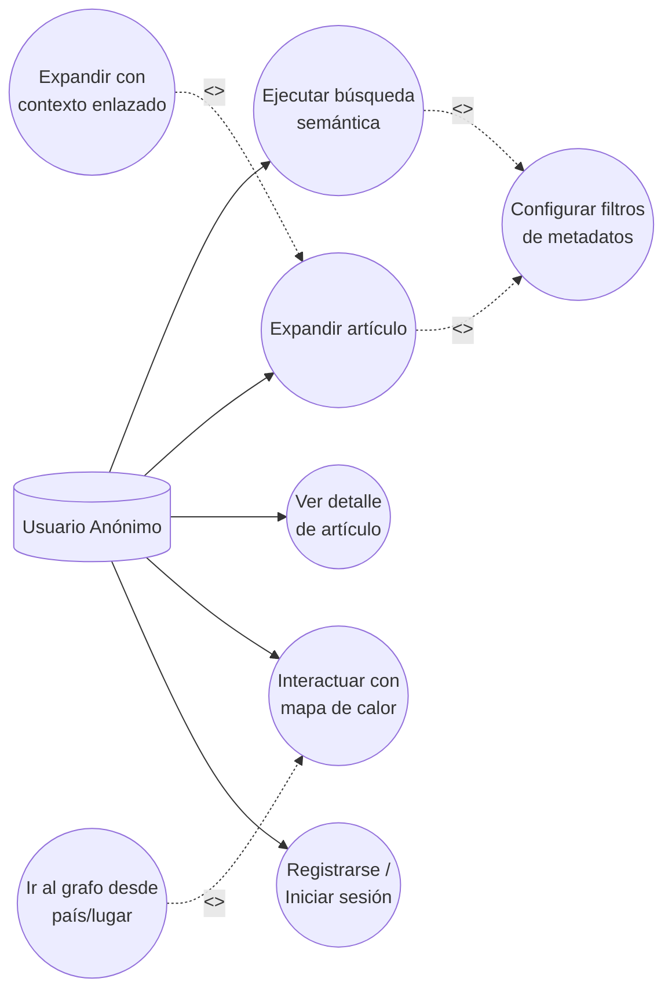
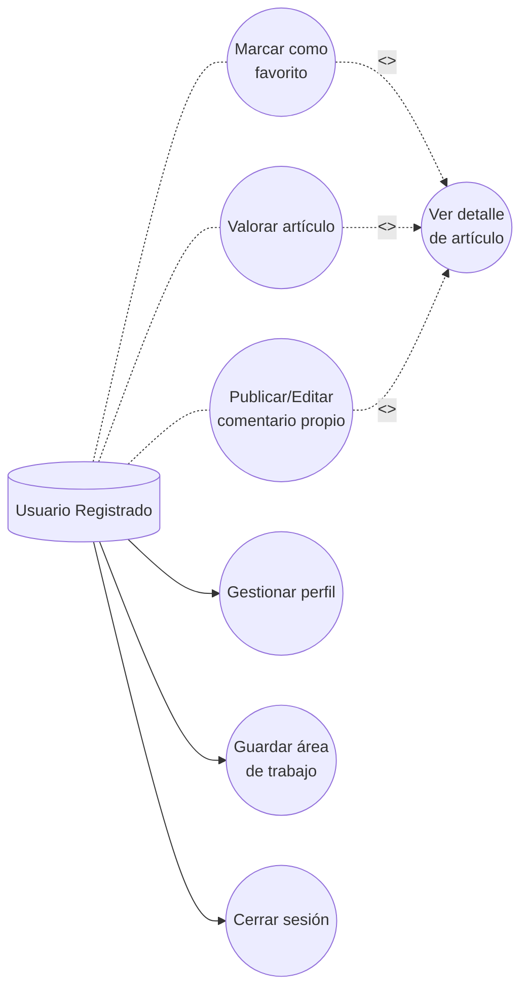
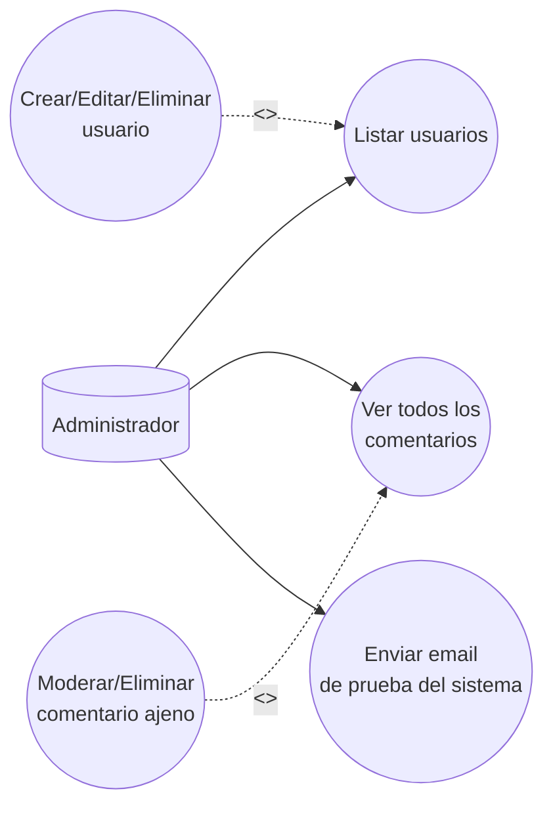

# Diagramas de Casos de Uso: Web Semantic Explorer

## 1. Generalización de Actores

Los actores mantienen una relación de herencia estricta:
*   **Usuario Anónimo:** Interacciones efímeras (solo lectura, estado en navegador).
*   **Usuario Registrado:** Hereda del Anónimo + interacciones con persistencia en BD (perfil, engagement, áreas de trabajo).
*   **Administrador:** Hereda del Registrado + panel de gestión (usuarios y moderación).

```mermaid
flowchart TD
    ANON[("Usuario Anónimo")]
    REG[("Usuario Registrado")]
    ADM[("Administrador")]

    ANON <|-- REG : <<generaliza>>
    REG <|-- ADM : <<generaliza>>
```

## 2. Casos de Uso del Usuario Anónimo (Exploración Efímera)

Interacción con el sistema sin requerir identidad en la base de datos.



## 3. Casos de Uso del Usuario Registrado (Engagement y Persistencia)

Hereda los casos anteriores e incorpora escritura en base de datos. Las acciones sobre artículos son extensiones del caso de uso base "Ver detalle de artículo".



## 4. Casos de Uso del Administrador (Gestión y Moderación)

Hereda los permisos del Usuario Registrado y añade privilegios exclusivos de infraestructura y moderación.

