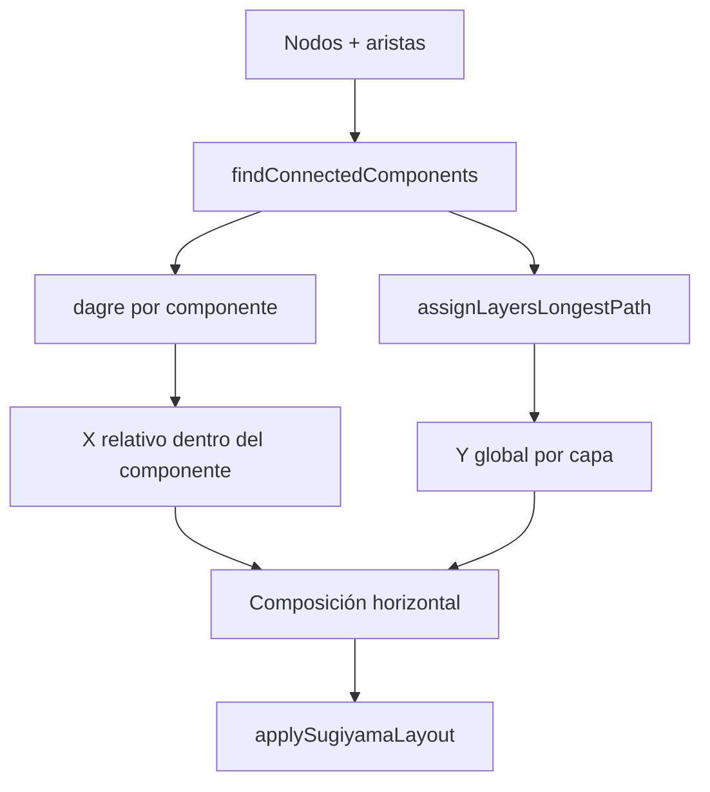

# Informe: layout DAG del graph explorer

Documento de referencia sobre el posicionamiento jerárquico del lienzo semántico tras la migración a **Sugiyama + Dagre**. Describe el comportamiento implementado, no un plan pendiente.

---

## Resumen

El explorador de grafos deja de usar un bosque de árboles d3 (`applyTreeLayout`) y pasa a un **layout jerárquico Sugiyama** basado en [`@dagrejs/dagre`](https://github.com/dagrejs/dagre), con composición **multi-componente**. El layout es puramente geométrico: recibe nodos y aristas, calcula capas y coordenadas, y escribe metadatos transientes en cada nodo.

La topología del pipeline de búsqueda (`query → filtro → artículo`) se corrigió para que los resultados cuelguen del **nodo terminal del pipeline**, no siempre del input. Eso alimenta capas coherentes en el layout (p. ej. input=1, filtro=2, artículos=3).

---

## Arquitectura del layout



| Módulo | Ruta | Responsabilidad |
|--------|------|-----------------|
| `applySugiyamaLayout` | `entities/graph/lib/explorer/graphLayout.ts` | Orquesta layout completo |
| `assignLayersLongestPath` | `entities/graph/lib/explorer/graphLayerAssignment.ts` | Capas 1-based (longest-path) |
| `findConnectedComponents`, `inDegree`, `filterSubgraph` | `entities/graph/lib/explorer/graphTopology.ts` | Topología del grafo |
| `GRAPH_LAYOUT_SUGIYAMA` | `entities/graph/lib/explorer/graphConstants.ts` | Dimensiones y separaciones |

Punto de entrada público: **`applySugiyamaLayout(nodes, edges)`**, exportado desde `@/entities/graph`.

---

## Algoritmo Sugiyama (Dagre)

Por cada **componente conexo** del grafo:

1. **Eliminación de ciclos** — `acyclicer: 'greedy'` (Dagre invierte aristas mínimas en ciclos).
2. **Asignación de capas** — `ranker: 'longest-path'` (no `network-simplex`).
3. **Capas dummy, minimización de cruces y coordenadas** — internas de Dagre.
4. **Dirección** — `rankdir: 'TB'` (arriba → abajo).

Regla de capas (también implementada en `assignLayersLongestPath` para alinear Y entre componentes):

```
capa(v) = 1                         si inDegree(v) === 0
capa(v) = 1 + max(capa(p) ∀ p→v)   si tiene padres
```

Con **multi-padre**, la capa es la del camino más largo (`max(padres) + 1`).

Constantes de espaciado (`GRAPH_LAYOUT_SUGIYAMA`):

| Parámetro | Valor | Uso |
|-----------|-------|-----|
| `nodeWidth` / `nodeHeight` | 300 × 220 | Caja Dagre por nodo |
| `horizontalGap` | 140 | `nodesep` |
| `verticalGap` | 300 | `ranksep` y paso entre capas globales |
| `componentGap` | 200 | Separación horizontal entre componentes |
| `offsetY` | 180 | Margen superior del lienzo |

---

## Composición multi-componente

Cuando el lienzo tiene varias islas inconexas (varias búsquedas, un favorito suelto, etc.):

- Se detectan componentes con **`findConnectedComponents`** (grafo **no dirigido**).
- Cada componente se layoutea con Dagre de forma independiente.
- **Eje Y:** alineado por **capa global** (`assignLayersLongestPath`), no por la Y local de Dagre. Dos nodos en capa 2 de componentes distintos comparten la misma fila vertical.
- **Eje X:** componentes colocados **en fila** (`componentGap`), no apilados verticalmente como en el antiguo bosque d3.
- **Centrado:** el conjunto se centra horizontalmente respecto a `window.innerWidth`.

Casos relevantes:

| Escenario | Comportamiento |
|-----------|----------------|
| Dos pipelines sin compartir nodos | Misma Y por capa; separados en X |
| Artículo compartido entre dos queries | Un solo componente; capa del artículo = `max(padres)+1` |
| Artículo favorito aislado | Componente de un nodo; capa 1 |

---

## Metadatos en nodos

Tras `applySugiyamaLayout`, cada nodo puede llevar:

| Campo | Persiste en workspace | Descripción |
|-------|----------------------|-------------|
| `layoutLayer` | No (strip en `migrateGraphSnapshot`) | Capa 1-based |
| `layoutComponentIndex` | No | Índice del componente conexo |
| `layoutOrder` | No | Orden horizontal dentro de la capa |
| `searched` | **Sí** | Input/filtros bloqueados tras búsqueda exitosa |

El routing de aristas sigue en React Flow (`GraphFlowEdge`, Bezier TB); Dagre no calcula rutas de edges.

---

## Integración con la búsqueda

Flujo en `useGraphSearch` tras respuesta API exitosa:

1. `resolveSearchAttachmentNodeId` — último nodo del pipeline `query → filtro → …` antes de artículos.
2. `createSearchResultNodes` — posición placeholder `{0,0}` (sin distribución radial).
3. `createSearchEdges(results, attachmentId)` — aristas al nodo terminal, no siempre al input.
4. `applySugiyamaLayout` — recalcula todo el lienzo.
5. `markPipelineSearched` — `searched: true` en input + filtros downstream.

Utilidades:

| Función | Ruta |
|---------|------|
| `resolveSearchAttachmentNodeId` | `lib/subgraph/resolveSearchAttachmentNodeId.ts` |
| `markPipelineSearched` | `lib/subgraph/markPipelineSearched.ts` |

**API sin cambios:** `searchArticlesWithFilters` y `resolveSearchContext` mantienen el mismo contrato.

**UX post-búsqueda:** `QueryNode` / `FilterNode` / `AuthorFilterCombobox` en read-only cuando `data.searched === true`. Nueva exploración textual = nuevo nodo query (p. ej. rama desde artículo).

`useMapSearchBootstrap` no duplica lógica: crea `query → filtro lugar` y delega en `searchFromInput`.

---

## Dónde se aplica el layout

| Acción | Archivo |
|--------|---------|
| Búsqueda desde input | `features/graph-search/lib/useGraphSearch.ts` |
| Expandir similares | `features/graph-expand/lib/useGraphExpand.ts` |
| Rama query + filtro desde artículo | `widgets/.../nodes/ArticleNode.tsx` |
| Drop de nodo desde paleta | `widgets/.../ui/GraphExplorer.tsx` |
| Inyectar favorito | `widgets/.../toolbar/FavoritesToolbar.tsx` |

---

## Eliminado respecto al layout anterior

| Antes | Ahora |
|-------|-------|
| `applyTreeLayout` (d3-hierarchy) | `applySugiyamaLayout` (Dagre) |
| `findLayoutRootIds`, `sortLayoutRootIds`, `assignNodesToLayoutRoots` | Topología global + componentes |
| `GRAPH_SEARCH_RADIAL`, `createSearchResultNodesAround` | Placeholder + Sugiyama |
| Dependencia `d3-hierarchy` | `@dagrejs/dagre` |

Alias deprecado: `GRAPH_LAYOUT_TREE` → `GRAPH_LAYOUT_SUGIYAMA` (compatibilidad de imports).

---

## Tests

Cobertura principal en `entities/graph`:

- `graphLayerAssignment.test.ts` — capas, multi-padre, pipeline input→filtro→artículos.
- `graphLayout.test.ts` — componentes, alineación Y/X, ciclos con acyclicer.
- `resolveSearchAttachmentNodeId.test.ts` — anclaje input / filtro / cadena.
- `markPipelineSearched.test.ts` — bloqueo del pipeline.
- `migrateGraphSnapshot.test.ts` — strip de props de layout; conservación de `searched`.

---

## Referencias

- [Handbook — Hierarchical Drawing (Tamassia)](https://cs.brown.edu/people/rtamassi/gdhandbook/chapters/hierarchical.pdf)
- [Dagre wiki](https://github.com/dagrejs/dagre/wiki)
- [React Flow — ejemplo Dagre](https://reactflow.dev/examples/layout/dagre)
